# Orchestrator Agent Implementation Plan

## Overview
The Orchestrator Agent is designed to be an intelligent repository management system that automates the analysis, planning, and management of GitHub repositories. It leverages AI capabilities to provide comprehensive oversight and automated workflows.

## Architecture Diagram

```mermaid
graph TD
    A[Orchestrator Agent] --> B[Repository Analysis]
    A --> C[Issue Management]
    A --> D[PR Management]
    A --> E[Strategic Planning]
    
    B --> B1[Code Structure Analysis]
    B --> B2[Dependency Mapping]
    B --> B3[Documentation Review]
    B --> B4[Log Analysis]
    
    C --> C1[Issue Creation]
    C --> C2[Labeling & Prioritization]
    C --> C3[Duplicate Detection]
    C --> C4[Sub-issue Generation]
    
    D --> D1[PR Labeling]
    D --> D2[Review Checklists]
    D --> D3[Priority Identification]
    D --> D4[Merge Recommendations]
    
    E --> E1[Feature Consolidation]
    E --> E2[New Feature Planning]
    E --> E3[Integration Planning]
    E --> E4[Coherence Assurance]
```



## Detailed Workflow

### 1. Repository Analysis Phase

**Code Structure Analysis:**
- Scans all source files to understand project architecture
- Identifies patterns, anti-patterns, and code quality issues
- Maps relationships between different modules/components
- Analyzes test coverage and quality

**Dependency Analysis:**
- Reviews package.json, requirements.txt, and other dependency files
- Identifies outdated dependencies and security vulnerabilities
- Maps dependency relationships and potential conflicts
- Suggests updates and optimizations

**Documentation Review:**
- Analyzes README, API docs, and inline documentation
- Identifies gaps in documentation
- Checks for consistency between code and docs
- Suggests improvements and additions

### 2. Issue Management Automation

**Issue Creation:**
- Automatically creates issues based on analysis findings
- Uses templates for different issue types
- Includes detailed descriptions and reproduction steps
- Assigns appropriate labels and priorities

**Labeling System:**
```
Type Labels:
- bug: Software defects and errors
- enhancement: New feature requests
- documentation: Documentation improvements
- question: User questions and clarifications
- maintenance: Code maintenance tasks

Priority Labels:
- high: Critical issues, security vulnerabilities
- medium: Important features, significant bugs
- low: Minor improvements, nice-to-have features

Complexity Labels:
- simple: Quick fixes, minor changes
- medium: Moderate effort, some research needed
- complex: Major changes, extensive work required

Component Labels:
- frontend: UI/UX related issues
- backend: Server-side logic
- database: Data layer issues
- infrastructure: DevOps and deployment
```

**Duplicate Detection:**
- Uses semantic similarity to identify duplicate issues
- Automatically suggests merging duplicates
- Maintains issue relationships and references
- Preserves important context from merged issues

### 3. Pull Request Management

**Automated Labeling:**
- Analyzes PR content to determine type
- Assigns size/complexity labels
- Identifies breaking changes
- Flags PRs requiring special attention

**Review Checklists:**
- Generates custom checklists based on PR type
- Includes security, performance, and testing checks
- Ensures documentation updates are included
- Verifies backward compatibility

### 4. Strategic Planning

**Feature Consolidation:**
- Identifies overlapping functionality
- Suggests code deduplication
- Proposes API unification
- Plans architectural improvements

**New Feature Planning:**
- Analyzes user needs and requests
- Evaluates technical feasibility
- Plans implementation roadmap
- Considers impact on existing features

**Integration Planning:**
- Maps integration points between features
- Identifies potential conflicts
- Plans migration strategies
- Ensures backward compatibility

## Implementation Steps

### Phase 1: Setup and Configuration
1. Create the workflow YAML file
2. Configure GitHub secrets and permissions
3. Set up the OpenCode CLI integration
4. Test basic workflow execution

### Phase 2: Core Analysis Features
1. Implement repository scanning logic
2. Add code quality analysis
3. Configure dependency checking
4. Set up documentation review

### Phase 3: Issue Management
1. Create issue templates
2. Implement labeling logic
3. Add duplicate detection
4. Configure sub-issue generation

### Phase 4: PR Management
1. Implement PR analysis
2. Add automated labeling
3. Create review checklists
4. Set up merge recommendations

### Phase 5: Strategic Planning
1. Add feature analysis capabilities
2. Implement consolidation logic
3. Create planning algorithms
4. Set up reporting mechanisms

## Success Metrics

**Quantitative Metrics:**
- Number of issues automatically created and categorized
- Reduction in duplicate issues
- Time to triage new issues
- PR review time reduction
- Code quality improvements

**Qualitative Metrics:**
- Improved repository organization
- Better feature coherence
- Enhanced documentation quality
- More strategic development approach
- Reduced manual management overhead

## Configuration Options

**Scheduling:**
- Daily runs at 00:00 UTC
- Manual trigger available
- Configurable frequency based on repository activity

**Model Selection:**
- qwen3-max for complex reasoning
- Can be adjusted based on performance and cost considerations

**Permissions:**
- Full repository access for comprehensive analysis
- Issue and PR management capabilities
- Ability to create and update content

## Security Considerations

- All operations use GitHub's secure token system
- No external API calls beyond OpenCode
- Sensitive information is handled securely
- Audit trail maintained for all actions

## Future Enhancements

1. **Integration with Project Management Tools**: Connect with Jira, Trello, etc.
2. **Advanced Analytics**: More sophisticated code analysis and metrics
3. **Custom Rules Engine**: Allow repository-specific rules and configurations
4. **Team Collaboration Features**: Enhanced team coordination capabilities
5. **Performance Monitoring**: Track agent performance and effectiveness over time